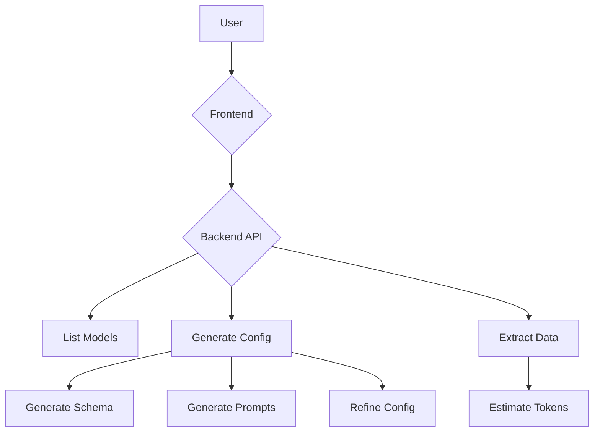

# Data Extraction Tool

This is a full-stack application for extracting data from various sources. The backend is built with Python and FastAPI, and the frontend is a Next.js application.

## Technologies Used

### Backend

- Python
- FastAPI
- Pandas
- Agno
- Pytest

### Frontend

- Next.js
- React
- TypeScript
- Tailwind CSS
- Genkit

## Getting Started

### Prerequisites

- Python 3.9+
- Node.js 18+

### Installation

1. **Clone the repository:**

   ```bash
   git clone https://github.com/your-username/Data-Extraction-Tool---Agno.git
   ```

2. **Backend Setup:**

   ```bash
   cd backend
   pip install -r requirements.txt
   ```

3. **Frontend Setup:**

   ```bash
   cd frontend
   npm install
   ```

### Running the Application

1. **Start the backend server:**

   ```bash
   ./start.sh
   ```

2. **Start the frontend development server:**

   ```bash
   cd frontend
   npm run dev
   ```

## Available Scripts

### Frontend

- `npm run dev`: Starts the development server.
- `npm run build`: Builds the application for production.
- `npm run start`: Starts a production server.
- `npm run lint`: Lints the code.
- `npm run typecheck`: Type-checks the code.

## Project Structure

```
.
├── backend
│   ├── app
│   ├── storage
│   └── ...
├── frontend
│   ├── src
│   └── ...
├── .gitignore
├── LICENSE
├── README.md
└── start.sh
```

## Application Flowchart

