# IntelliExtract Data Transform Workflow Flowchart

## Overview
This flowchart illustrates the complete data transformation workflow from document extraction to professional Excel generation.

## Workflow Diagram

```mermaid
flowchart TB
    Start([User Request + Files]) --> Cache{Check Cache}
    
    Cache -->|Cache Hit| CachedResult[Return Cached Excel]
    CachedResult --> End([Workflow Complete])
    
    Cache -->|Cache Miss| Phase1[🎯 Phase 1: Strategic Planning]
    
    %% Phase 1: Strategic Planning
    Phase1 --> Strategist[StrategicPlanner Agent]
    Strategist --> PlanPrompt[Create Extraction Plan<br/>- Analyze request<br/>- Evaluate files<br/>- Design approach]
    PlanPrompt --> PlanResponse{Valid Plan?}
    PlanResponse -->|No| PlanError[❌ Planning Failed]
    PlanError --> End
    PlanResponse -->|Yes| ExtractionPlan[ExtractionPlan Model<br/>- approach<br/>- steps<br/>- expected_output<br/>- challenges]
    
    %% Phase 2: Data Extraction
    ExtractionPlan --> Phase2[📊 Phase 2: Data Extraction]
    Phase2 --> Extractor[DataExtractor Agent]
    Extractor --> ExtractPrompt[Extract Data<br/>- Read files<br/>- Process documents<br/>- Structure data]
    ExtractPrompt --> ExtractResponse{Valid Data?}
    ExtractResponse -->|No| ExtractError[❌ Extraction Failed]
    ExtractError --> End
    ExtractResponse -->|Yes| ExtractedData[ExtractedData Model<br/>- data: Dict<br/>- metadata: Dict<br/>- quality_score: float<br/>- issues: List]
    
    %% Save JSON
    ExtractedData --> SaveJSON[Save to extracted_data.json]
    SaveJSON --> CacheExtracted[Cache Extracted Data]
    
    %% Phase 3: Excel Planning
    CacheExtracted --> Phase3[📋 Phase 3: Excel Planning]
    Phase3 --> DataAnalyst[DataAnalystAgent]
    DataAnalyst --> AnalyzePrompt[Analyze JSON & Plan Excel<br/>- Decide sheets<br/>- Define columns<br/>- Plan formatting]
    AnalyzePrompt --> AnalyzeResponse{Valid Spec?}
    AnalyzeResponse -->|No| NoSpec[Proceed without spec]
    AnalyzeResponse -->|Yes| ExcelSpec[ExcelSpecification Model<br/>- sheets: List<br/>- formatting_rules<br/>- total_records<br/>- summary]
    
    %% Phase 4: Excel Generation
    NoSpec --> Phase4[🎨 Phase 4: Excel Generation]
    ExcelSpec --> Phase4
    Phase4 --> ExcelGen[ExcelGeneratorAgent]
    ExcelGen --> GenPrompt{Has Spec?}
    GenPrompt -->|Yes| WithSpec[Generate with Specification<br/>- Use defined structure<br/>- Apply formatting rules]
    GenPrompt -->|No| WithoutSpec[Generate with Basic Structure<br/>- Auto-detect columns<br/>- Apply default formatting]
    
    WithSpec --> PythonScript[Create Python Script<br/>- Import pandas/openpyxl<br/>- Read JSON data<br/>- Create sheets<br/>- Apply formatting:<br/>  • Headers: Bold, #1F4788 bg<br/>  • Alt rows: #F2F2F2<br/>  • Borders: All cells<br/>  • Currency: $#,##0.00<br/>  • Dates: DD-MMM-YYYY<br/>  • Auto-width columns<br/>  • Freeze header row<br/>  • Add autofilters]
    WithoutSpec --> PythonScript
    
    PythonScript --> ExecuteScript[Execute Script]
    ExecuteScript --> FindExcel[Find *.xlsx files]
    
    %% Phase 5: Validation
    FindExcel --> Phase5[✅ Phase 5: Quality Validation]
    Phase5 --> Validator[QualityValidator Agent]
    Validator --> ValidatePrompt[Validate Excel<br/>- Check file exists<br/>- Verify formatting<br/>- Check completeness]
    ValidatePrompt --> ValidateResponse{Valid Result?}
    ValidateResponse -->|No| ValidateError[⚠️ Validation Issues]
    ValidateResponse -->|Yes| ValidationResult[ValidationResult Model<br/>- file_path<br/>- validation_passed<br/>- sheets_created<br/>- formatting_applied<br/>- issues]
    
    %% Final Steps
    ValidationResult --> CheckValid{Validation Passed?}
    CheckValid -->|Yes| CacheResult[Cache Excel Path]
    CacheResult --> Success[🎉 Success!<br/>Return Excel Path]
    CheckValid -->|No| ValidateError
    
    ValidateError --> End
    Success --> End
    
    %% Error Handling
    Phase1 -.->|Exception| ErrorHandler[Error Handler<br/>Log & Return Error]
    Phase2 -.->|Exception| ErrorHandler
    Phase3 -.->|Exception| ErrorHandler
    Phase4 -.->|Exception| ErrorHandler
    Phase5 -.->|Exception| ErrorHandler
    ErrorHandler --> End
```



## Agent Details

### 1. **StrategicPlanner Agent**
- **Model**: Reasoning model (e.g., o1-preview)
- **Purpose**: Analyze request and create extraction plan
- **Output**: `ExtractionPlan` (structured)
- **Features**: 
  - Reasoning enabled
  - Structured outputs
  - Show tool calls

### 2. **DataExtractor Agent**
- **Model**: Extraction model (e.g., gpt-4o)
- **Tools**: PythonTools, FileTools
- **Purpose**: Extract data from documents
- **Output**: `ExtractedData` (structured)
- **Features**:
  - File reading capabilities
  - Multiple format support
  - Data quality scoring

### 3. **DataAnalystAgent**
- **Model**: Extraction model
- **Tools**: PythonTools
- **Purpose**: Analyze data and plan Excel structure
- **Output**: `ExcelSpecification` (structured)
- **Key Decisions**:
  - Number of sheets needed
  - Column organization
  - Formatting requirements
  - Summary calculations

### 4. **ExcelGeneratorAgent**
- **Model**: Extraction model
- **Tools**: PythonTools, FileTools
- **Purpose**: Generate formatted Excel files
- **Key Features**:
  - Professional formatting
  - Multiple sheets
  - Color coding
  - Auto-formatting

### 5. **QualityValidator Agent**
- **Model**: Extraction model
- **Tools**: PythonTools, FileTools
- **Purpose**: Validate generated Excel
- **Output**: `ValidationResult` (structured)
- **Checks**:
  - File integrity
  - Formatting applied
  - Data completeness
  - Professional appearance

## Caching Strategy

```mermaid
flowchart LR
    Request[User Request] --> GenKey[Generate Cache Key<br/>hash(request + files)]
    GenKey --> CheckCache{Check session_state}
    CheckCache -->|Found| ReturnCached[Return Cached Result]
    CheckCache -->|Not Found| Process[Process Request]
    Process --> StoreCache[Store in session_state<br/>excel_reports.cache_key]
```

## Data Flow


## Error Handling

Each phase includes error handling:
- Try-catch blocks around agent calls
- Validation of response types
- Graceful degradation (e.g., proceed without spec)
- Detailed error logging
- User-friendly error messages

## Key Improvements from Agno Best Practices

1. **Structured Outputs**: All agents use Pydantic models for validated responses
2. **Proper Caching**: Uses `session_state` dictionary for intelligent caching
3. **Pure Python Flow**: No framework abstractions, just Python control flow
4. **Response Validation**: Every agent response is validated before use
5. **Helper Methods**: Clean separation of concerns with dedicated methods
6. **Professional Formatting**: Explicit formatting code in prompts ensures quality output

## Excel Formatting Details

The Excel generator applies these specific formats:
- **Headers**: Bold, 12pt, white text on #1F4788 background
- **Data Rows**: Alternating white and #F2F2F2
- **Borders**: Thin gray (#B8B8B8) on all cells
- **Currency**: $#,##0.00 format
- **Percentages**: 0.0% format
- **Dates**: DD-MMM-YYYY format
- **Numbers**: #,##0 with thousand separators
- **Column Width**: Auto-adjusted (max 50 chars)
- **Features**: Frozen header row, autofilters enabled

## Performance Optimizations

1. **Multi-level Caching**:
   - Final Excel results
   - Intermediate extracted data
   - Reusable across sessions

2. **Streaming Responses**:
   - Real-time progress updates
   - Better user experience
   - No timeout issues

3. **Error Recovery**:
   - Graceful degradation
   - Continue without optional components
   - Always attempt to produce output